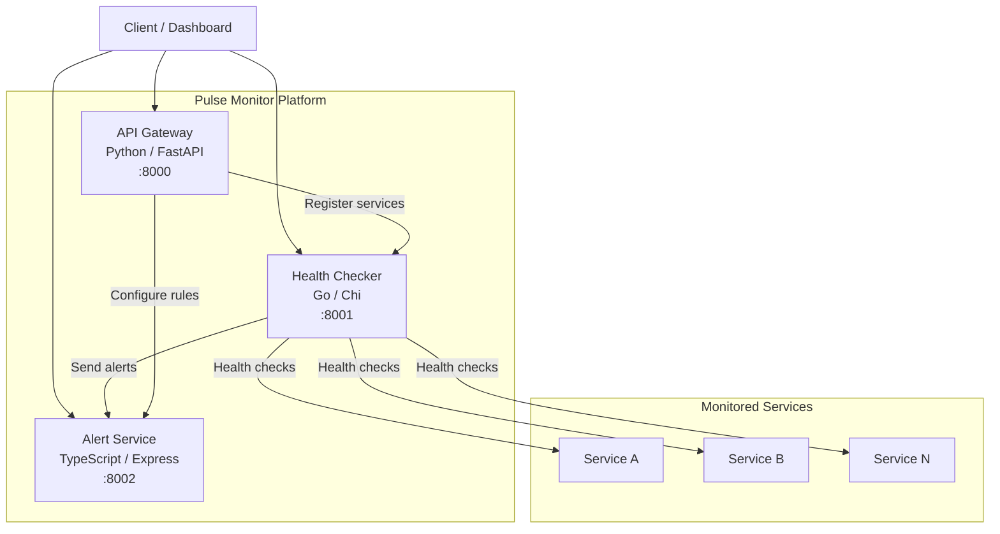

# Pulse Monitor

Real-time multi-service health monitoring platform. Register services, perform automated health checks, and receive alerts when services go down.

## Architecture



### Services

| Service | Language | Framework | Port | Description |
|---------|----------|-----------|------|-------------|
| **API Gateway** | Python 3.12 | FastAPI | 8000 | Central API for managing monitored services |
| **Health Checker** | Go 1.22 | Chi | 8001 | Performs HTTP health checks on registered services |
| **Alert Service** | TypeScript | Express | 8002 | Manages alert rules and triggers notifications |

## Quick Start

### Prerequisites

- Docker & Docker Compose
- Or: Python 3.12+, Go 1.22+, Node.js 20+

### Using Docker Compose

```bash
# Clone the repository
git clone https://github.com/mohadayo/pulse-monitor.git
cd pulse-monitor

# Copy environment variables
cp .env.example .env

# Start all services
make up

# Check health of all services
make health

# View logs
make logs

# Stop all services
make down
```

### Local Development

```bash
# Run all tests
make test

# Run linters
make lint

# Run individual service tests
make test-python
make test-go
make test-ts
```

## API Specification

### API Gateway (`:8000`)

| Method | Endpoint | Description |
|--------|----------|-------------|
| `GET` | `/health` | Health check |
| `POST` | `/services` | Register a new service |
| `GET` | `/services` | List all registered services |
| `GET` | `/services/{id}` | Get service details |
| `PUT` | `/services/{id}/status` | Update service status |
| `DELETE` | `/services/{id}` | Remove a service |

#### Register a Service

```bash
curl -X POST http://localhost:8000/services \
  -H "Content-Type: application/json" \
  -d '{"name": "web-app", "url": "https://example.com/health", "interval_seconds": 30}'
```

Response:
```json
{
  "id": "550e8400-e29b-41d4-a716-446655440000",
  "name": "web-app",
  "url": "https://example.com/health",
  "interval_seconds": 30,
  "status": "unknown",
  "last_checked": null,
  "created_at": "2025-01-01T00:00:00Z"
}
```

### Health Checker (`:8001`)

| Method | Endpoint | Description |
|--------|----------|-------------|
| `GET` | `/health` | Health check |
| `POST` | `/check` | Perform an on-demand health check |

#### On-Demand Health Check

```bash
curl -X POST http://localhost:8001/check \
  -H "Content-Type: application/json" \
  -d '{"url": "https://example.com/health"}'
```

Response:
```json
{
  "url": "https://example.com/health",
  "status": "healthy",
  "status_code": 200,
  "latency_ms": 145000000,
  "checked_at": "2025-01-01T00:00:00Z"
}
```

### Alert Service (`:8002`)

| Method | Endpoint | Description |
|--------|----------|-------------|
| `GET` | `/health` | Health check |
| `POST` | `/rules` | Create an alert rule |
| `GET` | `/rules` | List alert rules |
| `GET` | `/rules/{id}` | Get alert rule details |
| `DELETE` | `/rules/{id}` | Delete an alert rule |
| `POST` | `/alerts` | Trigger an alert |
| `GET` | `/alerts` | List all alerts |
| `PUT` | `/alerts/{id}/resolve` | Resolve an alert |

#### Create an Alert Rule

```bash
curl -X POST http://localhost:8002/rules \
  -H "Content-Type: application/json" \
  -d '{"serviceId": "svc-1", "webhookUrl": "https://hooks.slack.com/services/xxx"}'
```

#### Trigger an Alert

```bash
curl -X POST http://localhost:8002/alerts \
  -H "Content-Type: application/json" \
  -d '{"serviceId": "svc-1", "serviceName": "Web App", "message": "Service is unreachable"}'
```

## Environment Variables

See [`.env.example`](.env.example) for all available configuration options.

| Variable | Service | Default | Description |
|----------|---------|---------|-------------|
| `API_PORT` | API Gateway | `8000` | Port for the API Gateway |
| `CHECKER_PORT` | Health Checker | `8001` | Port for the Health Checker |
| `ALERT_PORT` | Alert Service | `8002` | Port for the Alert Service |
| `LOG_LEVEL` | All | `INFO` | Log level (DEBUG, INFO, WARN, ERROR) |
| `CHECK_TIMEOUT` | Health Checker | `5s` | Timeout for health check requests |
| `HEALTH_CHECKER_URL` | API Gateway | `http://health-checker:8001` | Health Checker service URL |
| `ALERT_SERVICE_URL` | API Gateway / Health Checker | `http://alert-service:8002` | Alert Service URL |
| `API_GATEWAY_URL` | Health Checker / Alert Service | `http://api-gateway:8000` | API Gateway URL |

## CI/CD

GitHub Actions workflow runs on every push and PR to `main`:

1. **test-python** — Lint with flake8, test with pytest
2. **test-go** — Vet and test Go code
3. **test-typescript** — Lint with ESLint, test with Jest
4. **docker-build** — Verify Docker Compose builds successfully

> **Note:** The `.github/workflows/ci.yml` file may need to be manually added after initial setup due to GitHub API limitations with the `.github/` directory.

### CI Workflow Content

```yaml
name: CI

on:
  push:
    branches: [main]
  pull_request:
    branches: [main]

jobs:
  test-python:
    runs-on: ubuntu-latest
    defaults:
      run:
        working-directory: api-gateway
    steps:
      - uses: actions/checkout@v4
      - uses: actions/setup-python@v5
        with:
          python-version: '3.12'
      - run: pip install -r requirements.txt
      - run: flake8 app/ tests/ --max-line-length=120
      - run: pytest -v

  test-go:
    runs-on: ubuntu-latest
    defaults:
      run:
        working-directory: health-checker
    steps:
      - uses: actions/checkout@v4
      - uses: actions/setup-go@v5
        with:
          go-version: '1.22'
      - run: go vet ./...
      - run: go test ./... -v

  test-typescript:
    runs-on: ubuntu-latest
    defaults:
      run:
        working-directory: alert-service
    steps:
      - uses: actions/checkout@v4
      - uses: actions/setup-node@v4
        with:
          node-version: '20'
      - run: npm install
      - run: npm run lint
      - run: npm test

  docker-build:
    runs-on: ubuntu-latest
    needs: [test-python, test-go, test-typescript]
    steps:
      - uses: actions/checkout@v4
      - run: docker compose build
```

## License

MIT
